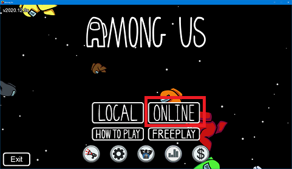

# 大生身内鯖の使い方

## なにこれ

この手順通りにやれば誰でもホストになれるよってこと

## 事前にダウンロードしておくもの

.NET 5.0 ランタイム  
https://dotnet.microsoft.com/en-us/download/dotnet/5.0  

Among Us Capture  
https://capture.automute.us/

## 手順

1. 部屋を作る  
    
    
    
1. ディスコ側の準備
     - ボイスチャンネルに参加した状態で`.au new`と打つ
     - DMでBotからサーバーのURLとCodeが送られてくるので控える  
          
1. ディスコ側の準備
     - ダウンロードした`AmongUsCapture.exe`を起動し、接続アイコンをクリック  
        
     - 控えたURLとコードを入力して登録を押すと準備完了  
        
